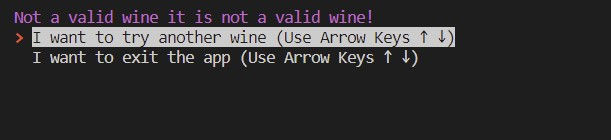
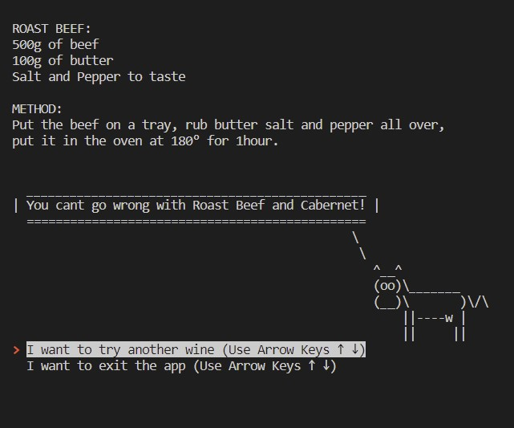

# **GusCosta_T1A3**

# T1A3 - Terminal Application

Click [here](https://github.com/Guscosta88/GusCosta_T1A3) To open Github Repo.

Click [here](https://youtu.be/qFXFjf9qJko) To open my Youtube video showing the whole process.

------

# **Purpose:**

#### **What does the app do?**

- It takes a user input with the name of a type of wine and it returns food options and recipes that pair with it.

#### **What problem does it solve?**

- It allows the user to aquire knowledge about the different types of wine and the food that goes with it.

#### **what is the main goal?**

- To show that anyone, after using the app, can buy a bottle of wine, cook food that pairs with it and enjoy the little things in life.

#### **Identify any code style guide or styling conventions that the application will adhere to.**

- The Python convention chosen to be applied in this application is the PEP 8 – Style Guide for Python Code, as it implies conventions, standards and good practices that contribute to a reliable, clear and inclusive code, which helps to avoid any confusion that might happen when someone other than the code's creator reads it.

Click [here](https://peps.python.org/pep-0008/) To open the link to PEP 8 – Style Guide for Python Code.

# **Functionality / features:**

#### **Wine_list, Wine class, Pair class, Recipe class:**

- The wine_list is a list with set variables that handles the data of each item within the classes.
  Every item of the wine_list is contained within the Pair class, which includes the self, wine, main, cheese and fruit attributes.
  The wine item inside of the Pair class is handled within the Wine class which includes self, name.
  Every Recipe item inside of the Pair class is handled within the Recipe class which includes self, name, description and recipe_type.
  Every class needed is imported within the main.py file.
  Each variable name contains all of this data and makes it easy to be accessed.

#### **Greetings class, welcome method, end method:**

- The Class Greetings holds two methods: 
  The welcome method that displays the ASCII file with the app's logo imported from the constant logo.py file and prompts the user to press enter to start.
  The end method that clears any remaining data with the help of the clearing py package, displays the ASCII bottle art imported from 
  the constant bottle.py file with a thank you and a Do not drink and drive message to be displayed when the user is done using the app.

#### **Init Function:**

- The init function displays an input question for the user asking for a wine name.
  It forces the first letter to be capitalized with the capitalize function.
  Once the user enters an input, it is saved in the input_message variable and checked in the list
  of available wines within the Wine class, a Boolean value is returned and stored in the is_wine_valid variable 
  the function sends it to the wine_validation function alongside the input_message variable.

#### **build_menu function:**

- The build_menu function uses the py package simple_term_menu to create an interactive terminal menu 
  and it holds two parameters, an options parameters that receives a variable from a chosen option, 
  and the return_string parameter that is set as True by default.
  if a string is returned the return_string parameter is set as True and a list of menu options coming from another function is shown, 
  if it is false it returns one item from the menu.

#### **wine_validation function(Error handling, it handles an input different then the available in the list of wines):**

- The wine_validation function receives the is_wine_valid, input_message parameters and if the Boolean of the is_wine_valid equals to 
  True it returns a message with the wine name alongside the pair_list_iteration showing three options of food that pair with that wine 
  to be chosen.
  if the Boolean of the is_wine_valid equals to False, it returns the input_message and an it is not a valid wine message, alongside the 
  app_options function that prompts the user to choose between 2 options, to either try another wine or leave the app.

#### **app_options function(Error Handling, it gives the user options if the input was invalid):**

- The app_options function has a variable called options that holds two strings with questions, prompting the user to choose
  betweeen leaving the app or chosing a different wine, an index variable calls the build_menu function and sends an options parameter
  and a boolean False returning the two options as prompts to be selected, if he chooses the option to try another wine the init function 
  is called again, if he chooses to leave the app, the end method is called prompting a goodbye message.

#### **pair_list_iteration function:**

- The pair_list_iteration function is the main logic behind the app and it is where the input 
  from the user is checked against the wine_list items, after passing through all of the other functions and the values from the wine_list are returned.
  A for loop iterates within the wine_list, and if the input_message variable that carries the input from the user matches the 
  wine name from the Wine class within the Pair class in the wine_list item and also if the item from the wine_list also matches 
  the wine attribute within the Pair class, it returns a list with 3 options, one option for main dish, one option for cheese, 
  and one option for fruit, these options are stored in a list called menu_options, this list is then send to the build_menu function 
  and displayed to the user to choose from, once the user chooses one of the three, the selection than goes to another set of conditionals
  where it is checked against the pair class attributes and if the main dish name equals to the main dish selected it returns the 
  recipe description, the same happens for cheese and fruit.
  this result is also checked against the cowsay_items function to return the cowsay message.
  The goal of the app is to show food options that pair with the wine that the user chose, so this concludes the app's purpose.
  after that the user can choose to remain in the app and try another wine or leave the app and receive a thank you, do 
  not drink and drive message.

#### **cowsay_items function:**

- The cowsay_items function holds a parameter called cowsay_check that receives the chosen recipe name from the pair_list_iteration 
  and it returns a cowsay item from the cowsay py package.
  If the item chosen was Pork it returns the pig cowsay, if it was the Roast beef it returns the cow, 
  if it was the Duck it returns the turkey, and if it was none it returns the T-rex.

------

# **A General break down of the app's functionalities:**

### **1. Welcome method welcomes the user and prompts the user to press enter to start.**

### **2. init function asks for a user input with the name of the wine:**

### **3. The class method is_valid_wine checks to see if the user input is available in the list of __available__wines, returning a True or False Boolean.**
### **4. If the is_valid_wine is True the app returns a list with options of foods that pair with that wine.**

### **5. If the is_valid_wine is False the app returns app_options function with a list with 2 options asking if the user wants to try a different wine or exit the app.**

### **6. Once the user picks a food option from the list, the app then checks if the item name matches the selected item and it returns a recipe for that item.**
### **7. Then the function app_options presents a list with 2 options asking if the user wants to try a different wine or exit the app.**

### **8. When the user chooses to try another wine the init function is run again.**
### **9. When the user chooses to exit the app an ASCII file with a bottle of wine and glasses is shown on the Screen with a thank you and a do not drink and drive message.**

### R7
## **Implementation Plan**
R7 - GET BACK TO THIS

### R8
## **Help Documentation**
R8 - GET BACK TO THIS

existing Python Packages:
simple_term_menu
clearing
cowsay
colorterminal